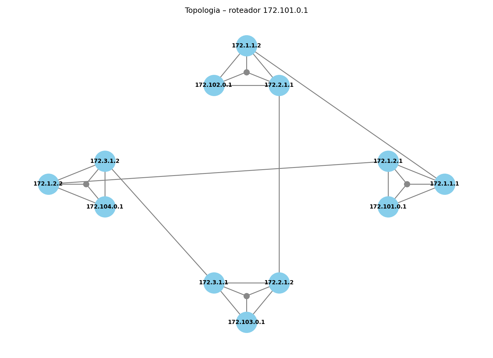

# 📂 Pasta `config` — Topologias Pré-Definidas

Esta pasta contém **modelos de topologias** em formato `.json`,  
usados pelo `launcher.py` para gerar automaticamente o `docker-compose.yml`.

Cada arquivo define:

- **Roteadores** com suas **interfaces WAN**.
- **Conexões** entre roteadores (enlaces).

## 📐 Exemplos de Topologias

### 🔄 Topologia Circular

### ➖ Topologia Linear

### 💎 Topologia Losango

### 🌐 Topologia Distribuída

### ⭐ Topologia Estrela

## ⚠️ Observação
- Sinta-se livre para **adicionar novas topologias**, seguindo o mesmo formato `.json`.
- Estes arquivos são **usados apenas no momento da geração** do `docker-compose.yml`.

- ## 🎓 Interpretação das Imagens Geradas

As imagens de topologia geradas pelo simulador representam cada **interface** dos roteadores como **pontos individuais (bolinhas)**.

Essas bolinhas orbitando um mesmo ponto central simulam as **interfaces físicas** de um roteador real, conectadas a diferentes redes.

Essa representação gráfica ilustra como um único roteador pode **administrar múltiplas interfaces** através de seus **barramentos internos**, **encaminhando pacotes entre elas** conforme as rotas calculadas dinamicamente.

> 📌 Exemplo:  
> Na imagem abaixo, as bolinhas conectadas entre si formam o conjunto de interfaces de um único roteador:

